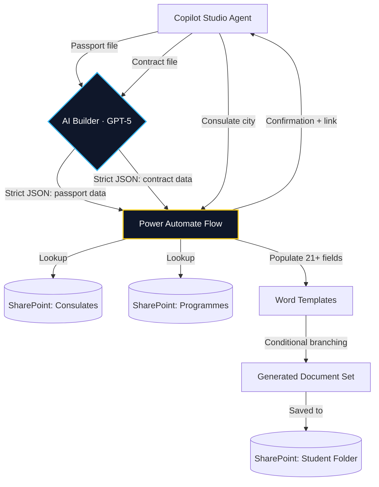

# Case Study Brief: Visa Set Builder Agent

## Context for the AI

I need you to create a new project case study page for my portfolio. This page must follow the **exact same structure, tone, and formatting** as my existing case studies (e.g., "Copilot Cowork Agent for Immigration Case Reconciliation" and "Onboarding SPA generated end-to-end by Microsoft Copilot Cowork"). Study those pages carefully before building this one. The tone is professional, narrative-driven, technically grounded but business-first. Every technical decision is justified by a business need.

This project should be placed as the **second project** in the portfolio, between the Immigration Case Reconciliation Agent (#1) and the Onboarding SPA (#3). PaddockPlan becomes #4. Update the project listing order on the Projects index page and any "Related projects" sections accordingly.

---

## Project Title

**Visa Set Builder: AI-Powered Document Generation via Copilot Studio**

Date: May 29, 2026  
Author: Luis Cañadilla

Opening subtitle/italic line:  
*A Copilot Studio agent backed by AI Builder and Power Automate that generates complete visa application document sets — enrollment certificates, accommodation letters, academic certificates, and scholarship letters — in under 4 minutes, from passport and contract uploads alone.*

---

## 1. Executive Summary

### The Problem

Every international student admitted to an IE University master's programme needs a set of official documents for their visa application at the relevant Spanish consulate or embassy. These documents include enrollment certificates (Spanish and English), an accommodation letter addressed to the specific consulate, an academic certificate for the programme, and — if applicable — a scholarship certificate (Spanish and English). Some consulates also require an electronic signature document.

Previously, an advisor had to manually create each document by hand: opening Word templates, locating the student's data across multiple sources, copy-pasting fields one by one (name, passport number, nationality, programme, dates, tuition fees, scholarship amounts…), formatting bilingual dates, and saving the files to the correct SharePoint folder. Each set took **10–12 minutes** to produce. Once done, the set required a **separate manual review by another team member** to catch errors — which added wait time and scheduling friction, especially during peak admissions.

At scale, this is brutal. In **September 2025 alone, the team produced 834 visa sets**. In January 2026, 322. For the September 2026 intake — still three months from closing — we have already processed 658 and counting. That is thousands of documents per year, each assembled by hand.

### The Solution

A **Microsoft Copilot Studio agent** ("Student Services – Visa Set Builder") deployed to the team via Microsoft Teams. The advisor tells the agent to generate a visa set, uploads the student's passport and signed master contract, and specifies the consulate city. The agent:

1. Uses **AI Builder (GPT-5 Chat)** to extract structured data from the passport (name, surname, gender, nationality in Spanish and English, passport number) as strict JSON.
2. Uses a second **AI Builder prompt** to extract contract data (programme, tuition paid, reservation fee, scholarship amount) as strict JSON, with rules to clean formatting artefacts.
3. Passes both JSON payloads plus the consulate city to a **Power Automate cloud flow** ("Visa set automation") that:
   - Matches the consulate city against a **SharePoint List of Spanish consulates and embassies worldwide** (with metadata: official name, country, city, whether the country is Spanish-speaking, and whether the consulate requires an electronic signature document).
   - Looks up the programme in a **SharePoint List of all IE master programmes** (with start date, end date, localized dates in Spanish and English, and total programme hours).
   - Populates **Microsoft Word templates** with 21+ dynamic fields, handling conditional branching for: gender (grammatical agreement in Spanish documents), scholarship vs. no scholarship, Spanish-speaking country vs. non-Spanish-speaking country (which changes the accommodation letter language variant), and electronic signature requirement.
   - Saves all generated documents to the student's SharePoint folder.
   - Returns a confirmation message with a direct SharePoint link to the generated set.
4. The advisor opens the folder, performs a **quick visual review** (checking that fields are populated and correct), and the set is ready for delivery. No second reviewer needed.

Total time per set: **~4 minutes** including review, down from 10–12 minutes + wait time for peer review.

---

## 2. Business Impact

Use these as bullet points with bold labels, same style as the other case studies:

- **~60% reduction in time per visa set.** From 10–12 minutes of manual assembly + peer review wait time, down to ~4 minutes including self-review. At 834 sets in a single intake (September 2025), this represents roughly **70–90 hours saved per peak intake** for the team.
- **Eliminated the peer-review bottleneck.** The previous process required a second advisor to manually verify each set. The standardized, template-driven output is consistent enough that advisors now self-review their own sets, freeing the second person entirely.
- **Scales with intake volume without scaling headcount.** September 2026 is already at 658 sets with three months remaining. The agent absorbs volume increases invisibly — the same 4 advisors and 2 interns handle the growing pipeline without additional staffing.
- **Deployed across the entire team.** After a pilot phase, the agent was published to Microsoft Teams and is now used by all 6 team members (4 advisors + 2 interns). It is not a personal tool — it is team infrastructure.
- **Handles consulate-specific requirements automatically.** The SharePoint-backed consulate registry determines at runtime whether an electronic signature document is required, which language variant to use for accommodation letters, and the correct official consulate name. Advisors no longer need to remember or look up these rules.

---

## 3. Architecture

Include a Mermaid diagram (same style as the other projects — graph TD, with styled nodes). Here is the architecture:



Below the diagram, explain the key architectural decisions in prose:

- **AI Builder as the extraction layer.** Rather than asking advisors to type student data manually, the agent delegates extraction to AI Builder prompts that parse passport scans and signed contracts. The prompts enforce strict JSON output with explicit rules against hallucination ("No inventes datos", "Si no aparece un importe, deja vacío").
- **SharePoint Lists as the reference data layer.** Consulate metadata and programme catalogues live in SharePoint Lists maintained by the team — no external database, no API dependency, no developer needed to update them. When a new programme launches or a consulate changes its requirements, any team member can update the list directly.
- **Conditional document generation.** The Power Automate flow handles 5 branching conditions: gender (Spanish grammatical agreement), scholarship status, Spanish-speaking vs. non-Spanish-speaking country, consulate electronic signature requirement, and programme-specific date/hours formatting. Each branch produces a different combination of Word templates.
- **Bilingual output by design.** All date fields are computed in both Spanish and English (FechaInicioES / StartDateEN) because consulates in different countries accept documents in different languages. The flow generates bilingual enrollment and scholarship certificates natively.

---

## 4. Technical Deep Dive

### 4.1 Strict JSON extraction from unstructured documents

The core AI challenge is identical to the one I solved in PaddockPlan: preventing the LLM from returning narrative text that would break the downstream automation. In AI Builder, I enforce this with explicit prompt constraints:

> *"Extrae del documento del pasaporte los siguientes campos y devuélvelos EXCLUSIVAMENTE como un objeto JSON válido. El resultado DEBE cumplir TODAS estas reglas obligatoriamente: La respuesta debe empezar directamente por el carácter { y terminar por el carácter }. NO incluyas ```json, ``` ni ningún otro tipo de bloque Markdown. NO añadas texto, explicaciones, títulos, comentarios ni saltos fuera del JSON."*

This is the same "strict schema compliance" pattern I documented in PaddockPlan's case study — but implemented natively within Microsoft's AI Builder rather than via the OpenAI API. The pattern transfers across stacks.

Include a screenshot of the AI Builder prompt for passport extraction here.  
Include a screenshot of the AI Builder prompt for contract extraction here.

### 4.2 SharePoint as a lightweight relational layer

The consulate registry (`Oficinas_Consulares_España`) includes fields that the flow uses for conditional logic:
- **CiudadNormalizada**: normalized city name for fuzzy matching against user input.
- **PaisHispanohablante**: boolean that determines which accommodation letter template to use.
- **FirmaElectronica**: boolean that triggers (or skips) electronic signature document generation.
- **TipoOficina**: "Consulado" vs. "Embajada" — used to populate the correct formal title in documents.

The programme registry (`LISTADO MASTERS`) provides:
- Start/end dates in both locales (September 21, 2026 / 21 de septiembre de 2026).
- Programme acronym, total hours, and full official name.

Include a screenshot of each SharePoint List here.

### 4.3 Conditional branching in Power Automate

The flow contains nested conditions that mirror real consular requirements:
- **Gender branching**: Spanish legal documents require grammatical agreement (e.g., "matriculado" vs. "matriculada", "becado" vs. "becada"). The gender extracted from the passport determines which Word template variant is populated.
- **Scholarship branching**: If the contract contains a scholarship amount, additional certificate templates (Spanish and English) are generated. If not, the flow skips them entirely.
- **Country-language branching**: For students applying at consulates in Spanish-speaking countries, the accommodation letter is generated in Spanish. For all others, in English. Within each language branch, the gender condition applies again.
- **Electronic signature branching**: Some consulates require a separate electronic signature verification document. The flow checks the SharePoint consulate record and conditionally generates this document.

Include 2-3 screenshots of the Power Automate flow showing the conditional branching (the gender/scholarship/country conditions). These are the most visually compelling screenshots.

### 4.4 Word template population

Each Word template contains dynamic content controls mapped to flow variables. The enrollment certificate alone uses 21+ parameters including programme name, tuition amounts, dates in dual locale, student personal data, and consulate-specific addressing. The flow populates all fields in a single action and saves the resulting document to SharePoint.

Include a screenshot of the Word template population step showing the 21 parameters panel.

---

## 5. The Outcome

The most interesting result is not just the time saved per set — it is the structural change in how the team works. Before the agent, visa set generation was a two-person task: one to create, one to review. That dependency created scheduling friction and bottlenecks during peak periods. Now it is a single-person task: the advisor who knows the student generates and reviews their own set in one sitting.

At the September 2025 scale of 834 sets, the manual process consumed roughly **140–170 hours of team time** (10–12 min creation + review time per set). The automated process, at ~4 minutes per set including self-review, consumes roughly **55 hours** — a net saving of **85–115 hours per intake**. For a team of 6 people managing multiple parallel workstreams, that is the difference between controlled operations and chronic overtime.

The agent is published to Microsoft Teams and used daily by all 4 advisors and 2 interns. It is production infrastructure, not a prototype.

Built with **Microsoft Copilot Studio**, **AI Builder (GPT-5 Chat)**, **Power Automate**, and **SharePoint**. Source code and production artifacts are internal to IE University and not publicly available.

---

## Screenshots to include (in order of appearance in the case study)

1. Copilot Studio agent overview (the one showing "Published 5/29/2026", agent name, GPT-5 Chat model — but WITHOUT the analytics section showing 0 sessions).
2. Copilot Studio topic flow — full "Generar certificados en PDF" topic showing: Trigger → Question (consulate) → Question (passport) → Prompt (passport extraction) → Prompt (contract extraction) → Action (Power Automate) → Message → Fin de la conversación. Use multiple screenshots to show the full topic if needed.
3. AI Builder prompt — "Extraer datos del pasaporte" (the one showing the JSON schema and strict rules).
4. AI Builder prompt — "Extraer datos contrato" (the one showing the contract JSON schema and cleaning rules).
5. SharePoint List — "Oficinas_Consulares_España" showing consulate records with metadata columns.
6. SharePoint List — "LISTADO MASTERS" showing programme records with dual-locale dates and hours.
7. Power Automate flow — the trigger showing "When an agent calls the flow" with the 3 input parameters (Pasaporte, Contrato, Ciudad).
8. Power Automate flow — the conditional branching for gender ("Condición - Hombre o mujer") showing the nested True/False paths with Spanish-speaking/non-Spanish-speaking sub-conditions.
9. Power Automate flow — the scholarship condition ("Condición beca") showing True/False paths.
10. Power Automate flow — the electronic signature condition showing Get PDF firma / Create file.
11. Power Automate flow — the Word template population step showing the 21 parameter panel.
12. Power Automate flow — the final section showing Link SharePoint → Redactar MensajeFinalAgente → Respond to the agent.

---

## Related Projects section

At the bottom of this case study, show as related projects:
1. Copilot Cowork Agent for Immigration Case Reconciliation
2. Onboarding SPA generated end-to-end by Microsoft Copilot Cowork

---

## Formatting and style notes

- Use the same section numbering style as the other case studies (1. Executive Summary, 2. Business Impact, etc.).
- Use the same "The Problem" / "The Solution" card layout (two side-by-side cards with light purple/blue background) for the Executive Summary.
- Business Impact should be a bulleted list with bold metric labels.
- Mermaid diagram should use the same styling (dark fill, colored strokes) as the other projects.
- Code/prompt excerpts should appear in styled code blocks with language labels.
- All prose should be in English.
- The overall tone is: confident, specific, business-outcome-driven, technically honest without being boastful. The narrator is someone who understands both the business process and the technical implementation deeply.
