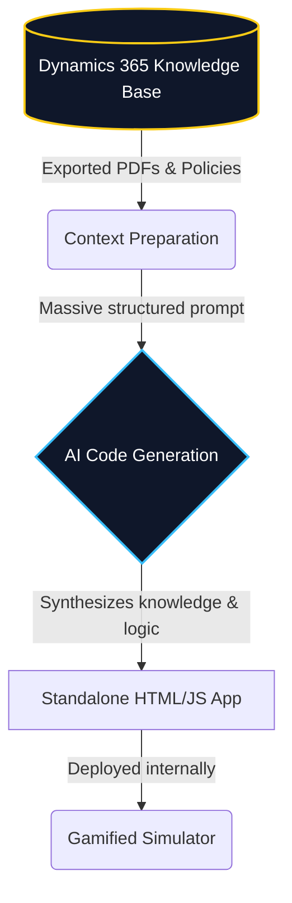

## 1. Executive Summary

<Row gap="16" wrap marginBottom="32">
  <Column flex={1} background="brand-alpha-weak" border="brand-alpha-medium" radius="l" padding="24">
    <Text variant="heading-strong-m" marginBottom="8">The Problem</Text>
    <Text variant="body-default-m" onBackground="neutral-weak">Standard onboarding involved dense PDF guides for complex Dynamics 365 processes, overwhelming new hires and consuming hours of senior staff time for 1-on-1 teaching.</Text>
  </Column>
  <Column flex={1} background="accent-alpha-weak" border="accent-alpha-medium" radius="l" padding="24">
    <Text variant="heading-strong-m" marginBottom="8">The Solution</Text>
    <Text variant="body-default-m" onBackground="neutral-weak">A gamified, interactive web app powered by Microsoft 365 Copilot Cowork, leveraging our internal Dynamics 365 knowledge bases to create self-paced roleplay simulators.</Text>
  </Column>
</Row>

### Business Impact
- **Reclaimed Senior Staff Time:** Reduced 1-on-1 daily training from 1.5 hours to just 30 minutes, saving roughly 20 hours per month per new hire.
- **Accelerated Time-to-Value:** Shortened the standard 1-month onboarding cycle, allowing new hires to operate independently much faster.
- **Self-Serve Knowledge:** The app acts as an interactive reference guide that advisors actively use while on calls with students, reducing interruptions.

---

## 2. The Build Process

Rather than building a standard chatbot that queries a database at runtime, I used generative AI to synthesize our complex Dynamics 365 process documentation into a self-contained, standalone web application. Here is the workflow used to generate the simulator:



---

## 3. Product Demo: The Simulator

*Experience the interactive gamified onboarding process below:*

<div style={{ 
  margin: '2rem calc(50% - 50vw)', 
  width: '100vw', 
  display: 'flex', 
  justifyContent: 'center',
  padding: '0 1rem'
}}>
  <iframe 
    src="/projects/ie-onboarding.html" 
    style={{ 
      width: '100%', 
      maxWidth: '1200px', 
      height: '85vh', 
      minHeight: '600px', 
      border: '1px solid rgba(255, 255, 255, 0.1)', 
      borderRadius: '12px', 
      background: '#fff',
      boxShadow: '0 8px 30px rgba(0,0,0,0.12)'
    }}
    title="Gamified Onboarding Simulator"
  ></iframe>
</div>

---

## 4. Technical Deep Dive

### Prompt Engineering for App Generation

The core technical challenge was not runtime AI hallucinations, but rather structuring an incredibly dense prompt that forced the AI to generate a functional, gamified Single Page Application (SPA) in one shot. 

I designed a rigorous system prompt that dictated strict technical constraints, state management, UI design tokens, and exact information architecture derived from our CRM.

Here is an excerpt of the system prompt used to orchestrate the build:

```markdown
# Project: IE Student Services Onboarding Companion

## Role and goal
You are a senior frontend engineer with strong design sensibility. Build a **single-page web app** that serves as an onboarding companion for new advisors joining the Immigration & Relocation team...

## Technical constraints (non-negotiable)
- One self-contained `.html` file. No build step, no frameworks, no external dependencies.
- Vanilla HTML + CSS + JavaScript only.
- Persistence via `localStorage` under the key `ie-onboarding-v1`. Migrate any legacy state shapes.
- Hash-based routing: `#home`, `#tasks`, `#progress`, `#roleplay`, `#guide/{id}`...

## Information architecture
Five visible categories on the tasks dashboard, plus a resources bucket. Each guide has `{ id, title, icon, category, subtasks[] }`. Only subtask checkboxes count towards progress.

1. **Essentials for arrival** 🎯 — health insurance, public transport...
2. **Housing** 🏠 — long-term accommodation and temporary accommodation...
3. **Immigration & paperwork: Non-European students** 🛂 — padrón, fingerprinting, NIE card...
...
```

By heavily constraining the AI—forcing vanilla JS, local storage for persistence, and hardcoding the institutional design system—I ensured the output was a predictable, highly performant tool that required zero server maintenance.

## 5. The Outcome

By intelligently applying AI and gamification, we modernized our operations and proved the tangible ROI of AI adoption in the workplace. Instead of feeling overwhelmed, new hires found the onboarding process refreshing and self-driven, allowing our job specialists to pivot their focus back to high-value, strategic tasks while maintaining a high standard of care for our people.
