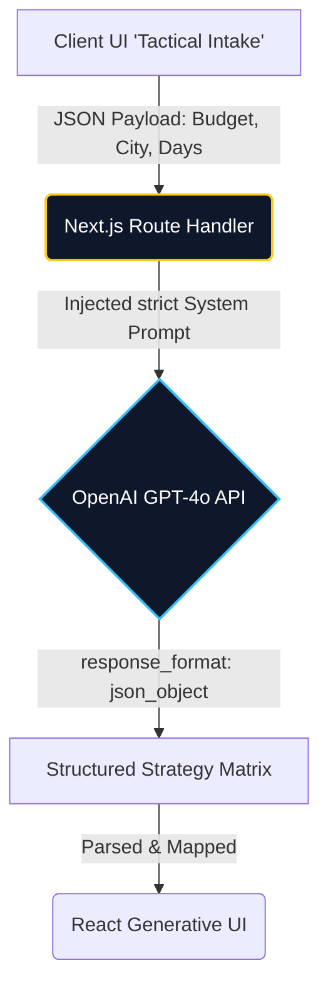

*Built as a deliberate technical exercise to understand LLM orchestration patterns from first principles — the same patterns I now apply within the Microsoft Copilot stack at IE University. Personal project, not affiliated with any employer.*

## 1. Executive Summary

<Row gap="16" wrap marginBottom="32">
  <Column flex={1} background="brand-alpha-weak" border="brand-alpha-medium" radius="l" padding="24">
    <Text variant="heading-strong-m" marginBottom="8">The Problem</Text>
    <Text variant="body-default-m" onBackground="neutral-weak">Planning attendance to a Formula 1 Grand Prix involves severe information asymmetry. Circuits are remote, transport is strained, and dynamic pricing spikes aggressively, forcing fans to rely on fragmented, outdated forums.</Text>
  </Column>
  <Column flex={1} background="accent-alpha-weak" border="accent-alpha-medium" radius="l" padding="24">
    <Text variant="heading-strong-m" marginBottom="8">The Solution</Text>
    <Text variant="body-default-m" onBackground="neutral-weak">An intelligent "Stealth Terminal" built with Next.js and OpenAI GPT-4o. It ingests user constraints (budget, origin, duration) to generate a hyper-personalized, dynamically priced logistical Blueprint in real-time.</Text>
  </Column>
</Row>

### Business Impact
- **Drastic Time Reduction:** Condensed the tactical planning phase from weeks of manual forum research to under 3 seconds of AI inference.
- **Strict LLM Contracts:** Enforced 100% schema compliance by utilizing OpenAI's JSON mode combined with rigorous system prompts, completely eliminating UI parse errors caused by narrative hallucinations.
- **Sub-Second Performance:** Achieved Sub-second Time to First Byte (TTFB) by bypassing no-code tools and deploying directly to Vercel's Edge network.

---

## 2. The Architecture

To ensure enterprise-grade reliability, I built a custom API infrastructure. The core engine is a Next.js Route Handler that securely orchestrates the OpenAI API, completely protecting backend credentials from the client.



### Azure Migration Path
While this prototype leverages Vercel and OpenAI, the architecture is designed to be platform-agnostic. In an enterprise Microsoft environment, this stack translates directly 1:1:
- **Next.js Edge** &rarr; **Azure Static Web Apps + Azure Functions**
- **OpenAI API** &rarr; **Azure OpenAI Service** (enterprise data privacy)
- **Vercel KV/Postgres** &rarr; **Azure Cosmos DB**

---

## 3. Product Demo

### Phase 1: Tactical Intake
*The intake form utilizes JetBrains Mono and a high-contrast palette, designed to evoke F1 telemetry.*

<div style={{ 
  margin: '2rem calc(50% - 50vw)', 
  width: '100vw', 
  display: 'flex', 
  justifyContent: 'center',
  padding: '0 1rem'
}}>
  <iframe 
    src="https://paddockplan.vercel.app/" 
    style={{ 
      width: '100%', 
      maxWidth: '1200px', 
      height: '60vh', 
      minHeight: '400px', 
      border: '1px solid rgba(255, 255, 255, 0.1)', 
      borderRadius: '12px', 
      background: '#000',
      boxShadow: '0 8px 30px rgba(0,0,0,0.4)'
    }}
    title="PaddockPlan Intake Demo"
  ></iframe>
</div>

### Phase 2: AI-Generated Blueprint
*Upon submission, the Next.js Edge function maps the LLM's strict JSON response to this dashboard, instantly rendering structured data into a predictable UI without hallucinations.*

<div style={{ 
  margin: '2rem calc(50% - 50vw)', 
  width: '100vw', 
  display: 'flex', 
  justifyContent: 'center',
  padding: '0 1rem'
}}>
  <iframe 
    src="https://paddockplan.vercel.app/blueprint/silverstone" 
    style={{ 
      width: '100%', 
      maxWidth: '1200px', 
      height: '85vh', 
      minHeight: '600px', 
      border: '1px solid rgba(255, 255, 255, 0.1)', 
      borderRadius: '12px', 
      background: '#000',
      boxShadow: '0 8px 30px rgba(0,0,0,0.4)'
    }}
    title="PaddockPlan Blueprint Demo"
  ></iframe>
</div>

---

## 4. Technical Deep Dive

### Strict JSON-Mode Inference

The most significant technical challenge when building Generative UI is preventing narrative text "hallucinations" from breaking the React frontend components. 

If the LLM returns conversational text (e.g., *"Here is your itinerary..."*) instead of pure data, the frontend parser will crash. To solve this, I enforced strict prompt engineering alongside OpenAI's JSON mode capability. 

Here is an excerpt of the inference logic:

```typescript
// Route Handler orchestration forcing JSON output
const response = await fetch('https://api.openai.com/v1/chat/completions', {
  method: 'POST',
  headers: {
    'Authorization': `Bearer ${process.env.OPENAI_API_KEY}`,
    'Content-Type': 'application/json',
  },
  body: JSON.stringify({
    model: "gpt-4o",
    response_format: { type: "json_object" }, // CRITICAL: Forces schema compliance
    messages: [
      {
        role: "system",
        content: `You are PaddockPlan's tactical AI. Return ONLY a valid JSON object matching this schema: 
        { "budgetTier": number, "recommendedAirport": string, "hotelZone": string, "alerts": string[] }. 
        No markdown, no narrative text.`
      },
      {
        role: "user",
        content: `Generate a strategy for ${circuit}. ${days} days. Origin: ${origin}. Budget: ${budget}.`
      }
    ]
  })
});
```

By heavily constraining the AI to pure data mapping, the React application can safely destructure the payload and dynamically render the budget tiers and transit recommendations without fear of UI breakage.

## 5. The Outcome

PaddockPlan successfully demonstrates how Generative AI can be harnessed to solve severe logistical friction in a niche market. The most critical lesson learned was architectural: **forcing JSON mode and a strict schema eliminated 100% of UI parse errors across all test runs.** While this rigorous constraint costs some degree of conversational flexibility from the LLM, it is a mandatory trade-off when building highly reliable, production-grade Generative UI.

- [View the GitHub Repository](https://github.com/LuisCPons/paddockplan)
