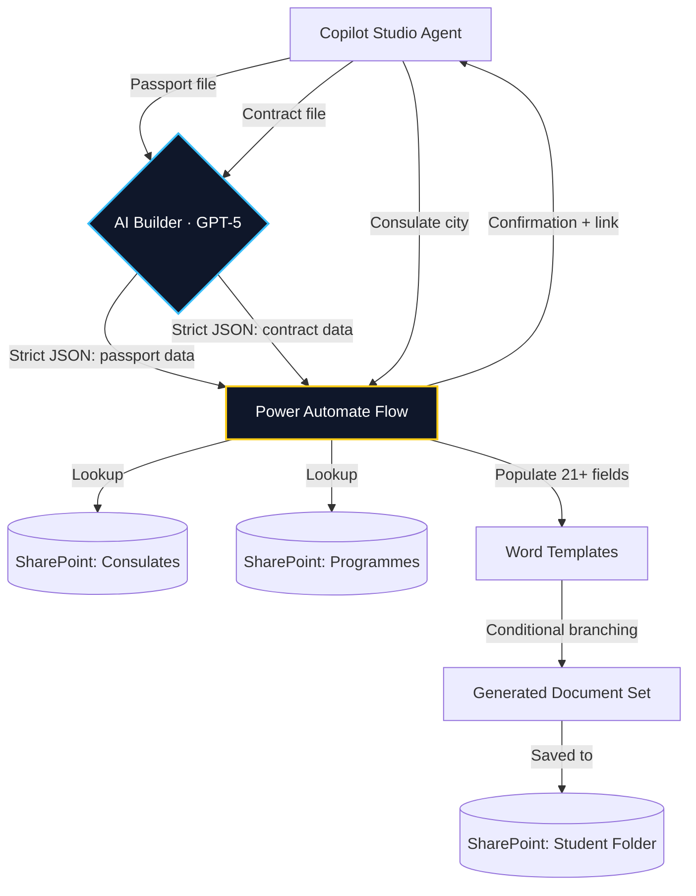

## 1. Executive Summary

<Row gap="16" wrap marginBottom="32">
  <Column flex={1} background="brand-alpha-weak" border="brand-alpha-medium" radius="l" padding="24">
    <Text variant="heading-strong-m" marginBottom="8">The Problem</Text>
    <Text variant="body-default-m" onBackground="neutral-weak">Every international student admitted to an IE University master's programme needs a set of official documents for their visa application: enrollment certificates (Spanish and English), an accommodation letter addressed to their specific consulate, an academic certificate, and — if applicable — scholarship certificates. An advisor had to manually create each document by hand: opening Word templates, locating the student's data across multiple sources, copy-pasting fields one by one, and formatting bilingual dates. Each set took 10–12 minutes to produce, plus a separate manual review by another team member. In September 2025 alone, the team produced 834 visa sets.</Text>
  </Column>
  <Column flex={1} background="accent-alpha-weak" border="accent-alpha-medium" radius="l" padding="24">
    <Text variant="heading-strong-m" marginBottom="8">The Solution</Text>
    <Text variant="body-default-m" onBackground="neutral-weak">A Microsoft Copilot Studio agent deployed to the team via Microsoft Teams. The advisor uploads the student's passport and signed master contract, specifies the consulate city, and the agent handles everything: AI Builder extracts structured data from both documents as strict JSON, a Power Automate flow matches the consulate against a SharePoint registry, looks up the programme, populates Word templates with 21+ dynamic fields including conditional branching for gender, scholarship status, and country language — and saves the complete document set to SharePoint with a direct link back to the advisor.</Text>
  </Column>
</Row>

### Business Impact
- **~60% reduction in time per visa set.** From 10–12 minutes of manual assembly + peer review wait time, down to ~4 minutes including self-review. At 834 sets in a single intake (September 2025), this represents roughly **70–90 hours saved per peak intake** for the team.
- **Eliminated the peer-review bottleneck.** The previous process required a second advisor to manually verify each set. The standardized, template-driven output is consistent enough that advisors now self-review their own sets, freeing the second person entirely.
- **Scales with intake volume without scaling headcount.** September 2026 is already at 658 sets with three months remaining. The agent absorbs volume increases invisibly — the same 4 advisors and 2 interns handle the growing pipeline without additional staffing.
- **Deployed across the entire team.** After a pilot phase, the agent was published to Microsoft Teams and is now used by all 6 team members (4 advisors + 2 interns). It is not a personal tool — it is team infrastructure.
- **Handles consulate-specific requirements automatically.** The SharePoint-backed consulate registry determines at runtime whether an electronic signature document is required, which language variant to use for accommodation letters, and the correct official consulate name. Advisors no longer need to remember or look up these rules.

---

## 2. Architecture



The architecture is deliberately constrained to the Microsoft 365 stack — no external APIs, no custom code, no Azure Functions. Every component is something the team can maintain without a developer:

- **AI Builder as the extraction layer.** Rather than asking advisors to type student data manually, the agent delegates extraction to AI Builder prompts that parse passport scans and signed contracts. The prompts enforce strict JSON output with explicit rules against hallucination ("No inventes datos", "Si no aparece un importe, deja vacío").
- **SharePoint Lists as the reference data layer.** Consulate metadata and programme catalogues live in SharePoint Lists maintained by the team — no external database, no API dependency. When a new programme launches or a consulate changes its requirements, any team member can update the list directly.
- **Conditional document generation.** The Power Automate flow handles 5 branching conditions: gender (Spanish grammatical agreement), scholarship status, Spanish-speaking vs. non-Spanish-speaking country, consulate electronic signature requirement, and programme-specific date/hours formatting. Each branch produces a different combination of Word templates.
- **Bilingual output by design.** All date fields are computed in both Spanish and English (FechaInicioES / StartDateEN) because consulates in different countries accept documents in different languages. The flow generates bilingual enrollment and scholarship certificates natively.

---

## 3. Walkthrough

The agent is published as "Student Services – Visa Set Builder" in Microsoft Teams. Below is the Copilot Studio configuration showing the agent and its conversational topic flow.

<div style={{ 
  margin: '2rem calc(50% - 50vw)', 
  width: '100vw', 
  display: 'flex', 
  justifyContent: 'center',
  padding: '0 1rem'
}}>
  
</div>

The conversational topic "Generar certificados en PDF" orchestrates the full pipeline: trigger → consulate city question → passport upload → AI Builder passport extraction → AI Builder contract extraction → Power Automate flow → confirmation message with SharePoint link.

<div style={{ 
  margin: '1rem calc(50% - 50vw)', 
  width: '100vw', 
  display: 'flex', 
  flexDirection: 'column',
  alignItems: 'center',
  gap: '0.5rem',
  padding: '0 1rem'
}}>
  
  
  
  
  
</div>

---

## 4. Technical Deep Dive

### 4.1 Strict JSON extraction from unstructured documents

The core AI challenge is identical to the one I solved in PaddockPlan: preventing the LLM from returning narrative text that would break the downstream automation. In AI Builder, I enforce this with explicit prompt constraints:

> *"Extrae del documento del pasaporte los siguientes campos y devuélvelos EXCLUSIVAMENTE como un objeto JSON válido. El resultado DEBE cumplir TODAS estas reglas obligatoriamente: La respuesta debe empezar directamente por el carácter `{` y terminar por el carácter `}`. NO incluyas ` ```json `, ` ``` ` ni ningún otro tipo de bloque Markdown. NO añadas texto, explicaciones, títulos, comentarios ni saltos fuera del JSON."*

This is the same "strict schema compliance" pattern I documented in PaddockPlan's case study — but implemented natively within Microsoft's AI Builder rather than via the OpenAI API. The pattern transfers across stacks.

<div style={{ 
  margin: '1rem calc(50% - 50vw)', 
  width: '100vw', 
  display: 'flex', 
  flexDirection: 'column',
  alignItems: 'center',
  gap: '0.5rem',
  padding: '0 1rem'
}}>
  
  
</div>

### 4.2 SharePoint as a lightweight relational layer

The consulate registry (`Oficinas_Consulares_España`) includes fields that the flow uses for conditional logic:
- **CiudadNormalizada**: normalized city name for matching against user input.
- **PaisHispanohablante**: boolean that determines which accommodation letter template to use.
- **FirmaElectronica**: boolean that triggers (or skips) electronic signature document generation.
- **TipoOficina**: "Consulado" vs. "Embajada" — used to populate the correct formal title in documents.

The programme registry (`LISTADO MASTERS`) provides:
- Start/end dates in both locales (September 21, 2026 / 21 de septiembre de 2026).
- Programme acronym, total hours, and full official name.

<div style={{ 
  margin: '1rem calc(50% - 50vw)', 
  width: '100vw', 
  display: 'flex', 
  flexDirection: 'column',
  alignItems: 'center',
  gap: '0.5rem',
  padding: '0 1rem'
}}>
  
  
</div>

### 4.3 Conditional branching in Power Automate

The flow receives three inputs from the Copilot Studio agent — the passport JSON, the contract JSON, and the consulate city — and orchestrates the full document generation pipeline.

<div style={{ 
  margin: '1rem calc(50% - 50vw)', 
  width: '100vw', 
  display: 'flex', 
  justifyContent: 'center',
  padding: '0 1rem'
}}>
  
</div>

The flow then enters nested conditional branching that mirrors real consular requirements:

- **Gender branching**: Spanish legal documents require grammatical agreement (e.g., "matriculado" vs. "matriculada", "becado" vs. "becada"). The gender extracted from the passport determines which Word template variant is populated. Within each gender branch, the flow further splits by Spanish-speaking vs. non-Spanish-speaking country — because accommodation letters use different language variants.

<div style={{ 
  margin: '1rem calc(50% - 50vw)', 
  width: '100vw', 
  display: 'flex', 
  justifyContent: 'center',
  padding: '0 1rem'
}}>
  
</div>

- **Scholarship branching**: If the contract contains a scholarship amount, additional certificate templates (Spanish and English) are generated with gender-appropriate grammatical agreement. If not, the flow skips them entirely.

<div style={{ 
  margin: '1rem calc(50% - 50vw)', 
  width: '100vw', 
  display: 'flex', 
  justifyContent: 'center',
  padding: '0 1rem'
}}>
  
</div>

### 4.4 Word template population and delivery

Each Word template contains dynamic content controls mapped to flow variables. The enrollment certificate alone uses 21+ parameters including programme name, tuition amounts, dates in dual locale, student personal data, and consulate-specific addressing.

<div style={{ 
  margin: '1rem calc(50% - 50vw)', 
  width: '100vw', 
  display: 'flex', 
  justifyContent: 'center',
  padding: '0 1rem'
}}>
  
</div>

Once all documents are generated and saved to the student's SharePoint folder, the flow composes a SharePoint link and returns a confirmation message to the agent. The advisor clicks through, performs a quick visual review, and the set is ready for delivery.

<div style={{ 
  margin: '1rem calc(50% - 50vw)', 
  width: '100vw', 
  display: 'flex', 
  justifyContent: 'center',
  padding: '0 1rem'
}}>
  
</div>

---

## 5. The Outcome

The most interesting result is not just the time saved per set — it is the structural change in how the team works. Before the agent, visa set generation was a two-person task: one to create, one to review. That dependency created scheduling friction and bottlenecks during peak periods. Now it is a single-person task: the advisor who knows the student generates and reviews their own set in one sitting.

At the September 2025 scale of 834 sets, the manual process consumed roughly **140–170 hours of team time** (10–12 min creation + review time per set). The automated process, at ~4 minutes per set including self-review, consumes roughly **55 hours** — a net saving of **85–115 hours per intake**. For a team of 6 people managing multiple parallel workstreams, that is the difference between controlled operations and chronic overtime.

The agent is published to Microsoft Teams and used daily by all 4 advisors and 2 interns. It is production infrastructure, not a prototype.

Built with **Microsoft Copilot Studio**, **AI Builder (GPT-5 Chat)**, **Power Automate**, and **SharePoint**. Source code and production artifacts are internal to IE University and not publicly available.
