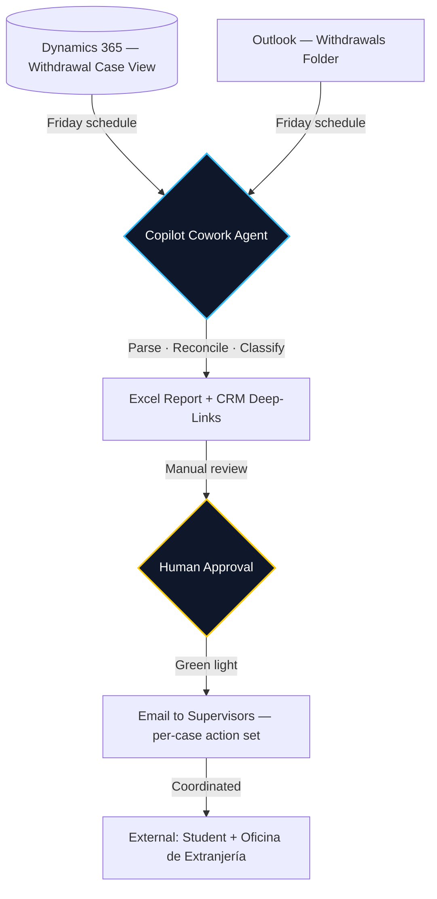

## 1. Executive Summary

<Row gap="16" wrap marginBottom="32">
  <Column flex={1} background="brand-alpha-weak" border="brand-alpha-medium" radius="l" padding="24">
    <Text variant="heading-strong-m" marginBottom="8">The Problem</Text>
    <Text variant="body-default-m" onBackground="neutral-weak">Student withdrawals trigger legally consequential actions: depending on visa status, our office must coordinate with consulates abroad or file a formal *desistimiento de permiso* with the Oficina de Extranjería in Spain. Cases arrive through Dynamics 365 and through email simultaneously, and reconciling them manually means cross-checking each student profile in CRM by hand. At roughly 5 minutes per case, the time tax becomes severe during the September intake, when volumes reach up to 20 withdrawals per week.</Text>
  </Column>
  <Column flex={1} background="accent-alpha-weak" border="accent-alpha-medium" radius="l" padding="24">
    <Text variant="heading-strong-m" marginBottom="8">The Solution</Text>
    <Text variant="body-default-m" onBackground="neutral-weak">A Microsoft Copilot Cowork agent, scheduled every Friday, that pulls the week's withdrawal cases from a Dynamics 365 view and the same week's withdrawal-related emails from a dedicated Outlook folder, reconciles them, classifies each case by legal pathway, and outputs an Excel with one-click CRM deep-links and the exact action required by both office and student. Nothing leaves my desk until I give the green light.</Text>
  </Column>
</Row>

### Business Impact
- **~90% reduction in weekly reconciliation time.** From ~30–90 min/week of manual CRM cross-checking (self-timed) down to 3–5 min/week of Excel review. Measured across 4 production weeks and ~47 cases, including a 35-case backlog reconciled in the first run. Validated alongside supervisors.
- **Scales for peak intake without scaling headcount.** September withdrawals run roughly 4× off-peak volume; the agent absorbs that scaling invisibly. My time now goes to the judgment calls on edge cases — which is where it should have been going all along.
- **Produces an auditable artifact.** Every weekly run yields an Excel with the full case list, reconciliation status, and required actions. The manual process produced nothing that could be reviewed three weeks later.
- **Keeps humans in the loop where it matters.** No communication — to students, supervisors, or the Oficina de Extranjería — leaves the system without explicit human approval.

---

## 2. Architecture

The orchestration is deliberately simple. The complexity lives in the AI steps in the middle (parsing, classifying, drafting), not in the moving parts around them.

---

## 3. Walkthrough

*This workflow handles confidential student data subject to Spanish data protection law (LOPDGDD / GDPR), so the screenshot below uses randomized names that mirror the production schema. Live data available on request under NDA.*

  

Each row is a single withdrawal case. The columns map directly to the agent's AI pipeline:
- **Reconciliation** — did the case appear in CRM, email, or both?
- **Legal Pathway** — which of the four regulatory branches applies?
- **Office Action / Student Action** — the exact next steps for each party.
- **⚠ REVIEW** — flagged cases the agent could not classify confidently, surfaced at the top for human judgment.

---

## 4. Technical Deep Dive

Three AI-driven steps sit at the heart of this agent. Everything else — scheduling, file generation, email dispatch — is mechanical Microsoft 365 plumbing.

### 4.1 Unstructured email parsing

Withdrawal-related emails arrive in many shapes: parents writing on behalf of a student, students writing in mixed Spanish and English, academic offices flagging withdrawals with no explicit "withdrawal" keyword. The agent extracts three things from each message — the student's identity, the implied withdrawal event, and any context suggesting urgency or sensitivity — and matches the result against the CRM view by student ID. This is the step that pure rule-based automation cannot do reliably; it is where the LLM earns its place in the pipeline.

### 4.2 Legal pathway classification

Each reconciled case is routed to the correct action set based on visa status, encoded directly from Spanish administrative practice:

- **Pre-arrival — no documents sent:** No consular action required.
- **Pre-arrival — documents sent, no visa application filed:** Coordinate with the consulate to confirm no application was filed.
- **Pre-arrival — visa application filed:** Coordinate with the consulate so the application is halted; no permit can be granted to a student no longer enrolled.
- **In Spain:** Both the student and our office must file the *desistimiento de permiso* with the Oficina de Extranjería, per Law 39/2015 governing administrative procedure.

The agent maps each case to one of these branches and writes the resulting action — for both office and student — directly into the Excel row.

### 4.3 Exception flagging

Not every case fits cleanly. Withdrawals tied to expulsion, programme transfers, partial documentation chains, or unusual timing edges (mid-semester arrivals, dual enrolments) require human attention before any communication is drafted. The agent surfaces these cases at the top of the Excel with a flag and a short explanation of why it could not classify them confidently. Routine cases process through; judgment cases stop for review.

### 4.4 Why the human-in-the-loop gate is not optional here

Immigration paperwork carries legal weight. An incorrectly filed *desistimiento* can affect a student's future visa eligibility for years; a missed communication to the Oficina de Extranjería can leave a student in an undefined legal status. The agent is deliberately designed to stop at the approval gate. AI handles the reading, reconciling, and classifying — work that scales poorly with human time — while every external communication remains a human decision. This is the responsible-AI pattern the Microsoft Copilot stack is built for, and it is the only pattern that should be deployed for workflows with legal consequences.

---

## 5. The Outcome

The interesting result here is not that the agent catches mistakes the manual process missed. The manual process was already meticulous and, to my knowledge, did not miss cases. The interesting result is that **the agent removes the time tax of being meticulous**. That tax used to peak exactly when it was most expensive — September intake, when withdrawals run 4× their off-peak volume — and now it no longer does.

It also produces something the manual process never did: an auditable, week-over-week record of every withdrawal handled, with reconciliation status, classification, and action taken. For a process with legal consequences, the audit trail is not a side effect — it is the second deliverable.

The pattern generalises beyond this use case. Any high-stakes workflow that involves reconciling structured CRM records against unstructured inbox traffic, classifying by domain-specific rules, and routing through human approval before an external action — admissions appeals, complaint handling, regulatory disclosures, refund authorisations — is a candidate for the same agent shape.

Built with [Microsoft Copilot Cowork](https://adoption.microsoft.com/en-us/copilot/agents/). Source code and production artifacts are internal to IE University and not publicly available.
